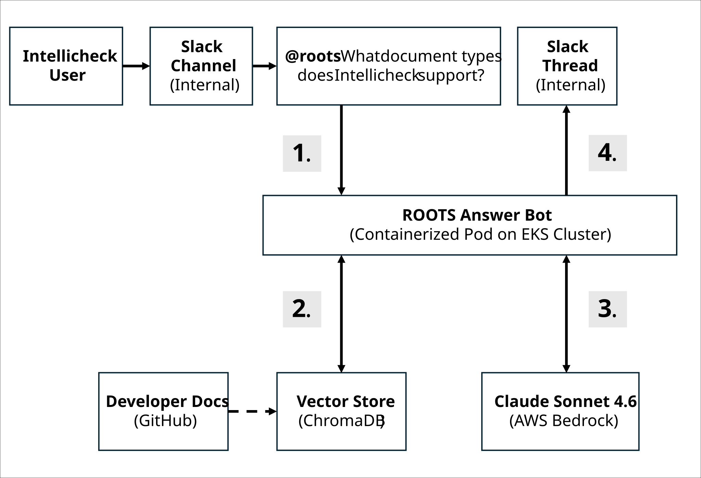

# ROOTS: AI Answer Bot Case Study

ROOTS (Retrieval Only On Technical Sources) is an AI answer bot that uses retrieval-augmented generation (RAG) to let Claude post answers in a Slack channel. It answers developer questions about Intellicheck OpenAPI specifications, developer guides, and curated, internal developer FAQs with citations back to source pages. This case study focuses on a few documentation and retrieval problems I identified and fixed. No underlying code is presented due to strict confidentiality.

## Overview
I conceived of ROOTS to solve a simple problem. Our VP of Data Science and Machine Learning, who was also my direct supervisor, found himself regularly answering the same types of questions. The questions came from internal employees, particularly solutions engineers, customer success, and new developers joining the team. These people were not as familiar with the detailed technical aspects of the company's software. We knew that the technical documentation I published already provided most of the answers. So my supervisor suggested we create a simple proof-of-concept answer bot using that documentation and a RAG framework. As opposed to referring questioners to the static documentation, we believed the answer bot would provide a certain novelty and interactivity that could improve user adoption and enhance learning.

After several iterations, I landed on ROOTS, a Slack-integrated bot with secure access to Claude in Amazon Bedrock. The architecture and deployment is not over-engineered given that I considered it a POC, and that the company has only around 50 employees. It runs on a single pod on the Elastic Kubernetes Service (EKS) cluster, connecting to Slack through a WebSocket based connection that Slack provides specifically so a bot can receive events without needing a public URL or ingress endpoint. In terms of expense, I estimate that for approximately 50 questions per day, the cost is around five dollars a month.

## Flow diagram

The following diagram shows the flow used by ROOTS as it receives and responds to a user question. The numbered events in the flow diagram are as follows:
1. ROOTS receives a question from the Slack channel.
2. ROOTS queries the vector store, which provides query results back to ROOTS.
3. ROOTS supplies query results to Claude, which provides a RAG response back to ROOTS.
4. ROOTS posts the response to a new thread in the Slack channel.

Note the block titled **Developer Docs** in the diagram. It sits outside the main question‑and‑answer flow because the documentation repository is not re‑embedded for each new question. The documentation is stored in GitHub as markdown files in a single repository. ROOTS replicates this repository on a regular six‑hour schedule using a Cron job, or on demand through an administrator command in Slack. The repo serves as the exclusive source of content for embeddings in the vector store, and includes the full OpenAPI specification, developer guides, code recipes, and standard FAQs that make up the developer‑focused knowledge base. Both embedding generation and vector storage are handled within the open‑source ChromaDB framework, which manages the creation, indexing, and retrieval of document embeddings for ROOTS.

## My role

I directed the design and development, fleshed out the requirements, tuned the retrieval results, and designed the system prompt. I worked with Claude Desktop and Claude Code to implement and test the Python. Essentially, it fell to me to own the entire project—from code commits to pull requests to automated deployments—since the system itself fulfilled a technical communications function. 

## Challenges

A standard RAG setup follows a common process: chunk the docs, embed them, and retrieve by vector similarity. This process works well for conceptual questions, but it broke down on two common query patterns for our technical documentation:

- **Numeric identifiers.** A question like "what does status code 1213 mean" embeds poorly. A bare number carries almost no semantic signal, so vector search can miss the exact answer even when it's sitting in the index.
- **Named endpoints.** A question like "what does /end return" gets diluted by unrelated content that happens to share vocabulary with the endpoint's own name, and thus the endpoint content loses to less relevant chunks in a purely semantic ranking.

> Both problems reveal the gaps you find by watching users ask real questions, and then tracing why the bot provided a poor response.

{style="note"}

## Solutions

- **Deterministic passes ahead of vector search.** Status codes and named endpoints are matched exactly first, and those hits are pinned to the top of the retrieved context rather than left to compete on similarity score alone. Vector search still runs and fills the remaining slots, so this approach doesn't replace semantic retrieval. Instead, it patches the specific cases where semantic retrieval structurally underperforms.
- **Query parsing for endpoint questions.** To disambiguate a user question about an endpoint vs. a question about non-endpoint functionality, ROOTS evaluates the construction and form of the question text according to three tests. The first test looks for a word prefixed by a forward slash, such as /start or /end. The second test evaluates a hyphenated segment as a bare word, such as get-results. The third test identifies a common word like start or end adjacent to an indicator phrase such as endpoint or end point. If these tests return hits, then the response folds in the endpoint's API specification chunks as pinned top matches.

Those two solutions alone solved many of the challenges that initially surfaced during beta testing. As additional challenges were identified, further improvements refined the responses provided by ROOTS:
- **Authority-weighted ranking.** When conflicting or overlapping results are found from different sources, the OpenAPI spec and vetted internal knowledge outranks general-purpose content.
- **Table-aware chunking.** Long reference tables (like status-code tables) are split on row boundaries with the header repeated on every piece, so no chunk loses its column context mid-table. I traced this problem back to specific documentation in a lengthy status-code table that wasn't being retrieved correctly.
- **A written scope boundary in the system prompt.** ROOTS answers API questions only; it explicitly declines UI-behavior and other non-developer topics, for example, questions about the company's retention policy for personally identifiable information. ROOTS explicitly declines to respond, rather than guessing or answering outside its authoritative source material.
- **Zero-downtime reindexing.** The bot can rebuild its knowledge from the latest documentation, either on demand, or on a set schedule, which prevents content drift.

## Outcomes

ROOTS became the internal team's day-to-day reference for questions about the company's API, endpoints, and integration processes. It reduced repeat interruptions for subject-matter experts and consolidated scattered tribal knowledge into a single repository. Most importantly for me, my supervisor had an authoritative resource to share with others. In side-by-side demonstrations against general-purpose assistants, ROOTS consistently gave grounded, technically accurate answers with cited sources, instead of plausible-sounding guesses.

## Conclusion

I've come to believe that retrieval quality is a documentation problem as much as an engineering one. If technical writers can understand *why* a question fails to retrieve the right chunk, then they can specify a fix precisely enough for an engineer (or an AI coding assistant) to implement it. This is similar in concept to knowing why a reader can't find the answer in your documentation, and being able to implement the proper content audits or design choices to fix the docs. Retrieval optimization skills will become essential as technical writers inevitably evolve into roles such as content engineering and knowledge management.